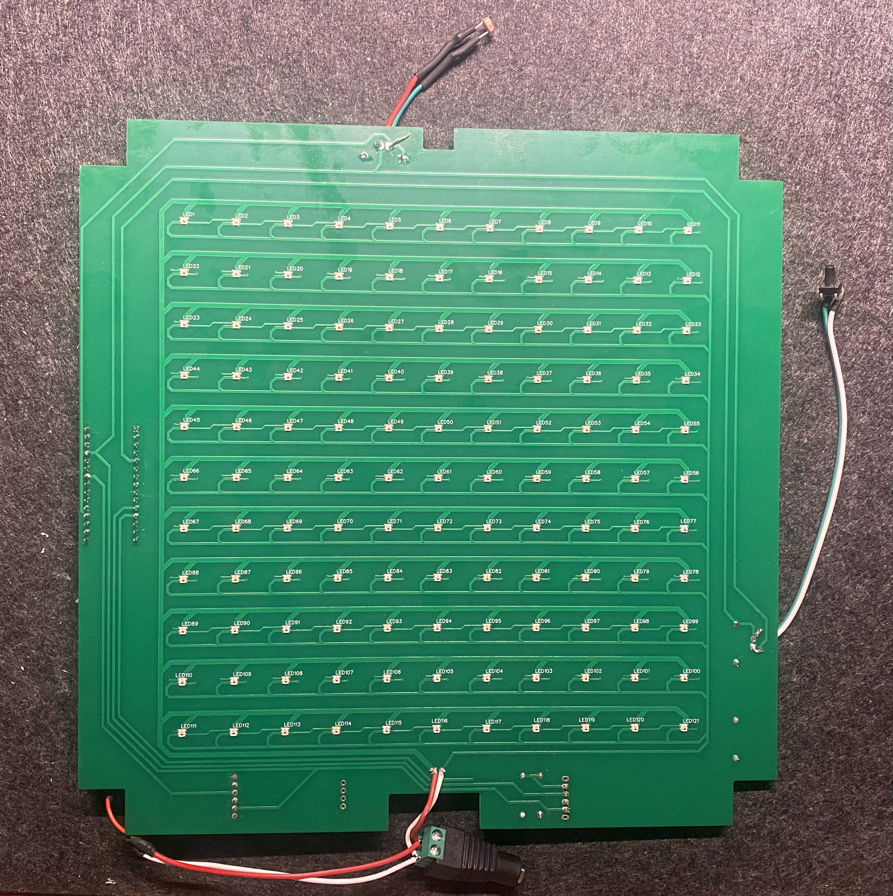
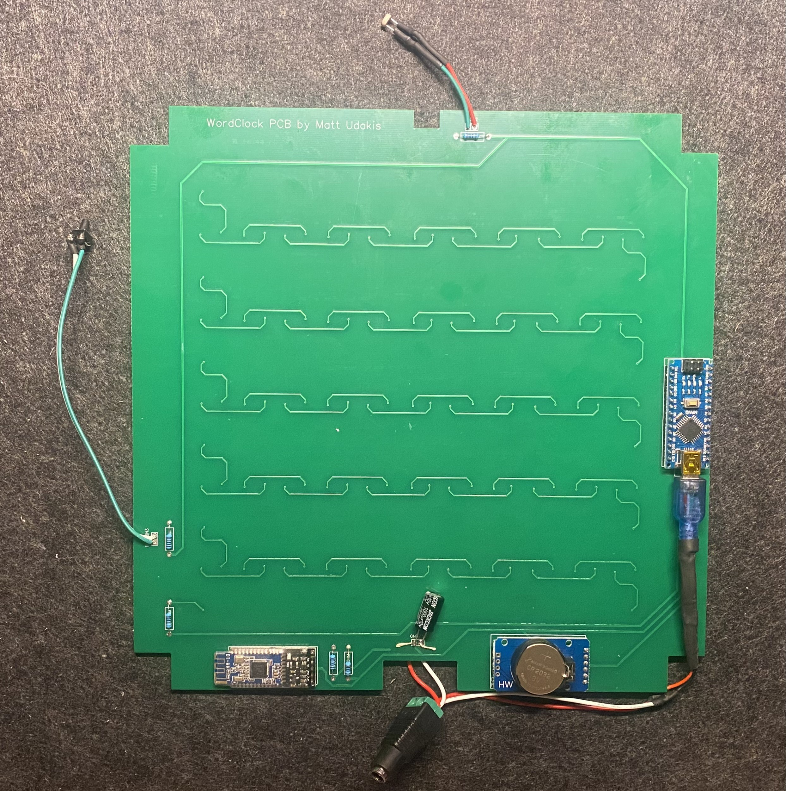

# Custom PCB with WS2812b 2020 LEDs

This folder contains the custom PCB with surface mount addressable LEDs.

`note that these LEDs are the WS2812b - 2020 these are much smaller than the standard and they dont need a capacitor for each LED`

 

## Assembley

To assembled the PCB solder on the components including the arduino, HM10, RTC and the resistors as described in the instructions. the assembled PCB should look like this:

  

