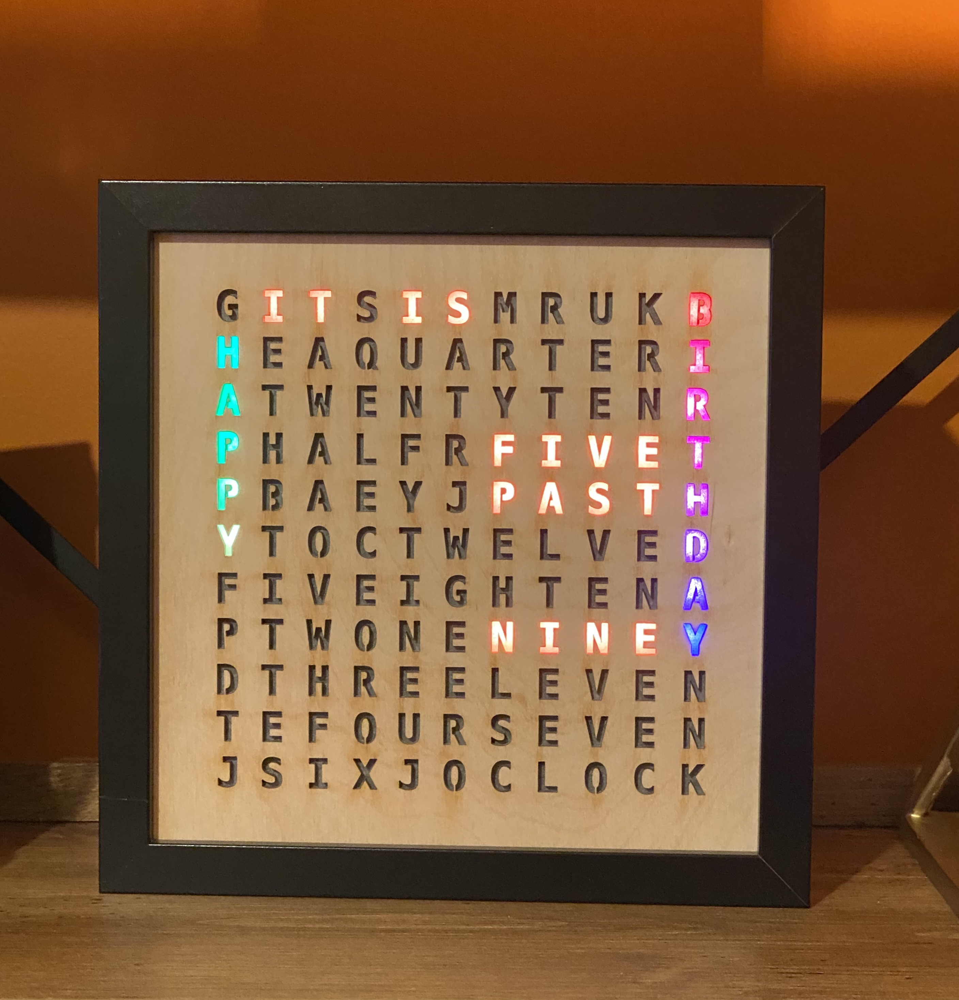
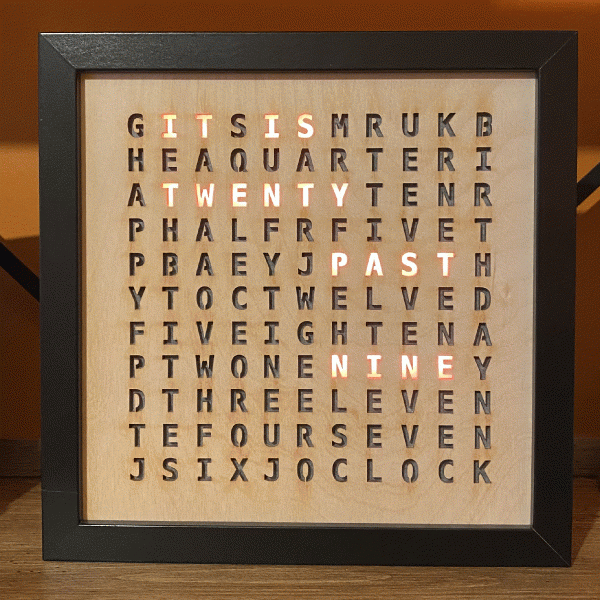
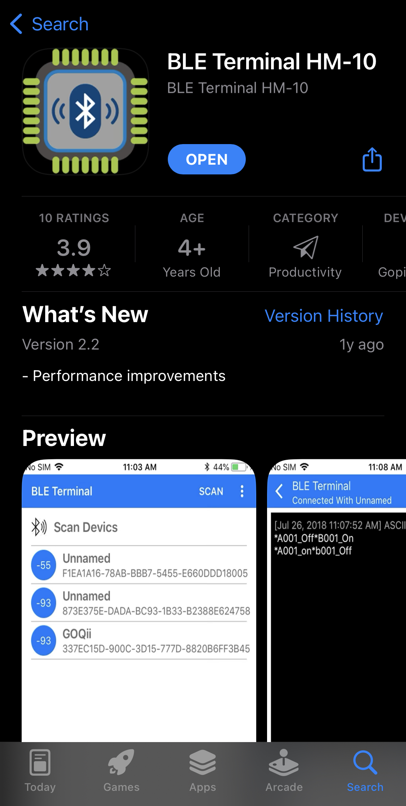
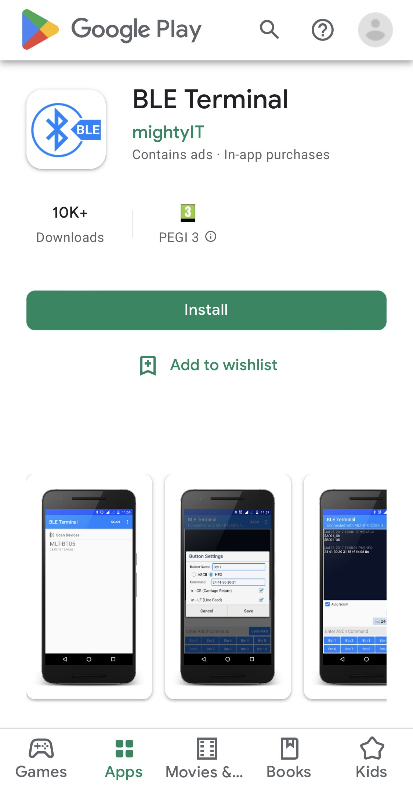
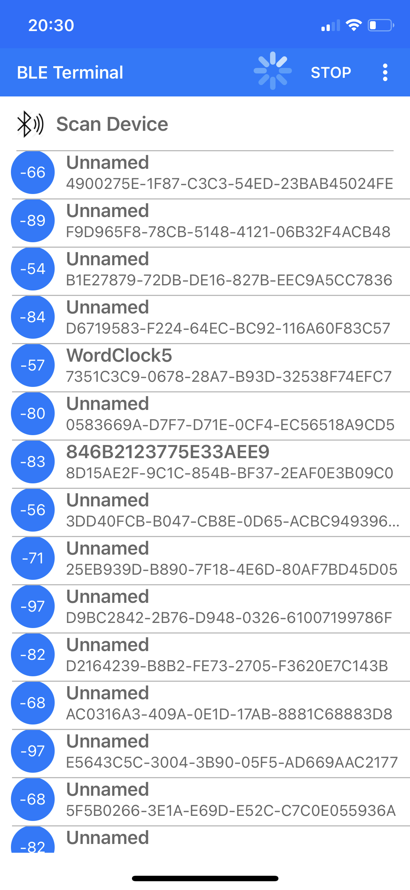
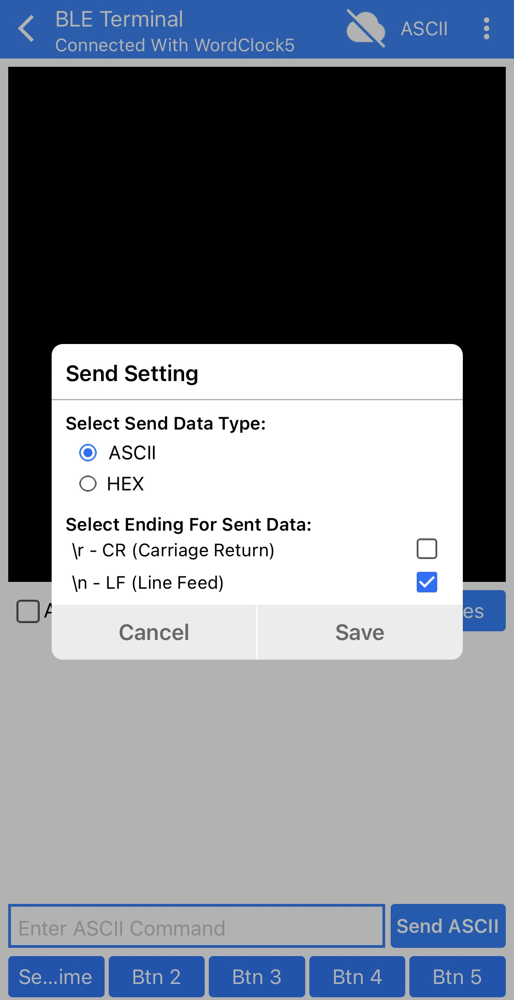
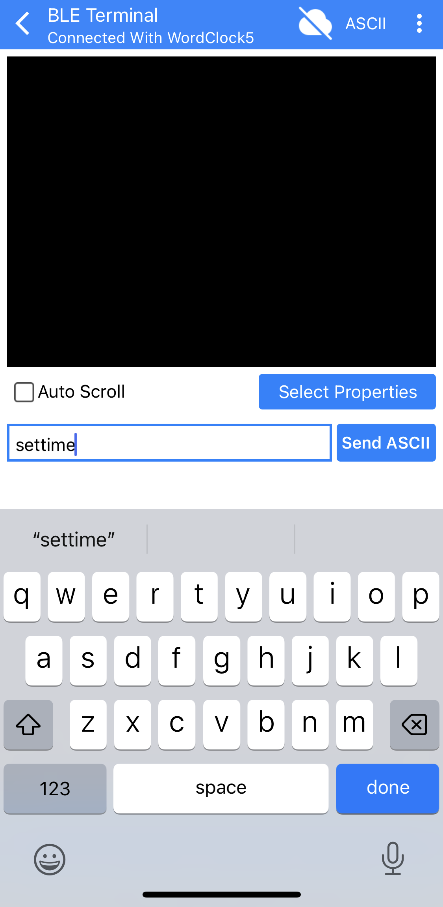
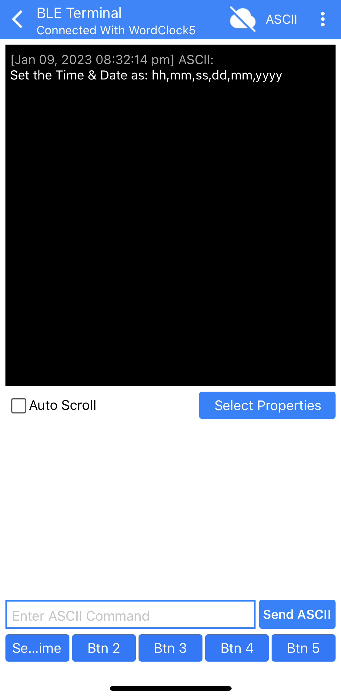
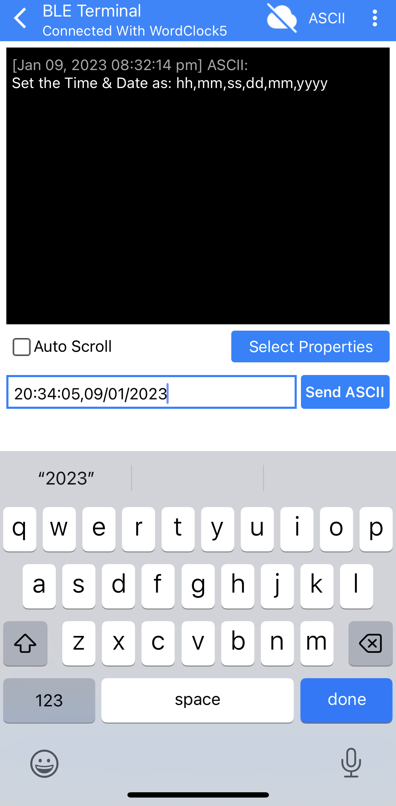
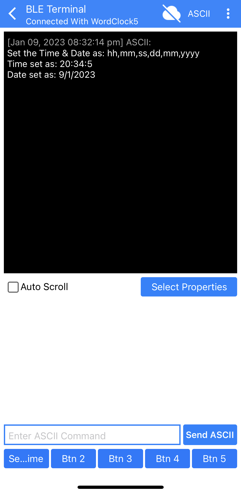

# Arduino based LED WordClock

 

## Contents 
 1. [Features](#features) - WordClock features.
 2. [Components](#components) - Components used to make the clock.
 3. [Circuit](#circuit) - Circuit and wiring diagram for the clock's electronics
 4. [Fabrication Process](#fabrication-process-step-by-step) - Guide for the clock's build process.
 5. [Setting the time and date](#setting-the-time-and-date-via-bluetooth-app) - How to set time and date via Bluetooth terminal app.   

&nbsp;

## Features

* LED colour change button
* On the hour and quarter hour LED animations 
* Birthday LED message on set dates
* Automatic LED brightness control via photoresistor
* Real time clock (RTC) time keeping with automatic daylight-saving time changes

&nbsp;

Happy Birthday message and some different colour options

 

On the hour and quarter hour animations

 

## Components

| Component             | Description                              | Source		              |Reference            | Quantity  |
|-----------------------|------------------------------------------|----------------------------------|---------------------|-----------|
|Frame		        | Box photo Frame 23x23 cm                 | Ikea	                      | Black RIBBA*        | 1         |
|Letter cut outs        | Laser cut panel 3mm birch plywood        | online laser cutting service     | 		    | 1	        | 
|Baking paper	        | 23 x23 sheet to diffuse LED light        | grocery store     		      | 		    | 1	        | 
|LED dividers	        | Dividers to isolate LED light            | online laser cutting services    | 1.5mm backing board | 1         |  
|LED array template     | Card template to attach LED strips       | online laser cutting services    | 1.5mm backing board | 1         |
|MDF board	        | 230 x 230 x3mm for back of clock         | Hardware store/ online	      | 3mm thickness	    | 1	        | 
|LED strip              | addressable LEDs 60/meter 12mm interval  | Amazon/AliExpress                | 60 IP30, WS2812BECO | 121 LEDs  |  
|Arduino nano           | Arduino/Elegoo nano                      | Amazon/AliExpress	              | ATmega328P	    | 1         |
|Real time clock (RTC)  | RTC with battery to keep time            | Amazon/AliExpress	              | DS3231		    | 1         |
|Bluetooth BLE module   | BLE Bluetooth for remote connection       | Amazon/AliExpress	              | HM-10		    | 1         |
|Push button (momentary)| button to cycle through LED colour       | Amazon/AliExpress	              | Tactile Push Button | 1         |
|Photoresistor          | measures ambient light to set brightness | Amazon/AliExpress	              | GL5516		    | 1         |
|Wire                   | wire to connect components together      | Amazon/AliExpress	              | 		    | <1 m      |
|Heat shrink tubing	| heat shrink to tidy soldered connections | Amazon					|		| 				|
|Soldering iron/solder  | soldering iron to solder all components  | Amazon/hardware store            |                     |           |
|Custom PCB	        | optional custom PCB to solder components | online PCB manufacturer          | 		    | 1         |
|Resistors 		| 1x330 1x1K, 1x2K, 2x10k 		   | Amazon/AliExpress	              | 		    | 5         |
|Capacitor              | 100uF 50V for power surge protection	   | Amazon/AliExpress	              | 		    | 1         |
|Power Jack		| 5.5 X 2.1mm DC power Jack 		   | Amazon/AliExpress	              | 		    | 1         |
|DC power supply	| 5Volts 3Amp  		  		   | Amazon		              | 		    | 1         |
|Mini USB-A cable	| Cable  used for Arduino power            | Amazon/AliExpress	              | 		    | 1         |
|Square wood dowel	| 10 x 10 x 30mm square dowel for backplate| Hardware store/ online	      | 		    | 4         |
|M2x10 micro screws	| flat head screws for attaching backplate | Hardware store/ online	      | 		    | 4         |
|Glue gun with glue	| glue gun to fix components 		   | Hardware store/ online	      | 		    | 1         |
|Drill bits and drill	| 12mm, 2mm, and 6mm drill bits and drill  | Hardware store/ online	      | 		    | 3         |

*The Ikea RIBBA frame in black has been discontinued. An oak version is still available, which could be spray painted. Alternative frames of the same size can be found on Etsy.
&nbsp;

## Circuit

#### Circuit components can be connected following the Arduino clock circuit

&nbsp;

#### Alternatively a Custom PCB can also be fabricated for ease of assembly.
PCB files found [here](CustomPCB/)

&nbsp;

## Fabrication process step-by-step
The assembly process involves the following steps 
1. [Frame assembly](#1-frame-assembly)
2. [LED array and power input assembly](#2-led-array-and-power-input-assembly)
3. [Arduino circuit soldering](#3-arduino-circuit-soldering)
4. [Button and photoresistor assembly](#4-push-button-and-photoresistor-assembly)
6. [Backplate fabrication and final assembly](#5-backplate-fabrication-and-final-assembly)
7. [Loading firmware onto the Arduino](#6-loading-the-code-onto-the-arduino)

&nbsp;
 
#### 1. Frame assembly
- Discard all parts of the frame except for frame itself.
- Take the wooden laser cut clock face and place it face down within the frame.
- Cut out a piece of baking paper the same size as the clock face and place on top of the clock. 
> This will diffuse the LED light to evenly light each letter. 
- Assemble the dividers and place on top of the baking paper/ clock face. 

 &nbsp;
---
#### 2. LED array and power input assembly

**Power input assembly** 
- Take the USB cable and strip the external casing to expose the 4 wires.
- Trim off the two data wires (these are usually green and white) leaving just the power and ground wires.
- Extend the power and ground wires and tidy up the connections to add more stability.
- With two additional pieces of wire solder the capacitor between them (see [circuit diagram](#circuit)) this will connect to and power the LED array. 
- Connect both sets of wires to the DC jack making sure the wires are securely in place.

 

&nbsp;

**LED array assembly**
- Cut the addressable LEDs to 11 LED strips.
- Solder the LED strips in a snake like orientation starting from the bottom left.
> The LEDs are directional so make sure they are solder in the correct direction. This soldering is time consuming, be patient and use soldering flux to help.
- Tidy up the soldering connections with some electrical tape or heat shrink tubing.
- Get the LED array template. 
- Using a glue gun, add a little glue between each hole in the template and glue the LED strip to the template.
> Do this one strip at a time to prevent glue drying. Don't glue the first part of the first strip as access to this is needed later.

&nbsp;
---
#### 3. Arduino circuit soldering
Using either the custom PCB or manual wiring, connect the HM-10, DS3231 RTC and the Arduino nano together. 
If using manual wiring follow the [circuit diagram](#circuit) ensuring the correct resistors are included. 

> The custom PCB will save a lot of time and add more stability to the electronics so this is recommended.
  
For assembly via the PCB
- Solder the Arduino nano, HM-10 and DS3231 RTC to the PCB along with the various resistors.

&nbsp;
---
#### 4. Push button and photoresistor assembly
The colour of the LEDs in the clock can be altered using a push button attached to the back of the clock. In addition the brightness of the clock is automatically adjusted to the environments ambient light levels.

&nbsp;

**Making the brightness photoresistor**
- Solder two wires to the photoresistor and tidy the solder contacts with electrical tape or heat shrink tubing.
- Using a drill, drill a hole slightly larger than the photoresistor diameter.
> To prevent damage to the top of the clock, stick some tape over the drilling area.
- Using a glue gun, glue the photoresistor into the drilled hole ensuring it is flush with the top of the clock frame and securely in place. 

&nbsp;

**Making the push button**
- Solder a small push button to two wires, tidying the connections with heat shrink/ tape.
- Make sure the wires are long enough so that when attached to the Arduino the back plate can be removed.
- *Optional* solder two female jump cable connectors to the wires so that it can be easily removed from the main assembly. Then solder two male header pins to two additional wires that will be then soldered to the Arduino.

&nbsp;
---
#### 5. Backplate fabrication and final assembly

**Backplate assembly**
- If no pre-cut backplate is available cut a 2-3mm piece MDF or plywood to the same dimensions as the front plate (23x23cm).
- Using a large drill bit (12 mm), cut a hole at the centre bottom of the backplate. Try to align this with where the DC jack will be glued to the inside of the frame.
- Using a smaller drill bit, drill a hole the same size as the pushbutton button head.
- Using a glue gun, glue the button assembly to the inside of the backplate, ensure that the button mechanism isn’t glued. 
- Cut some small pieces of square/circle dowel (1cm diameter) and glue them to the inside corners of the frame.
> These should be cut to a length that when the backplate rests on them the backplate is flush with the back of the frame.
- Place the backplate onto the back of the frame and using a very small drill bit, drill holes through the base plate and the dowels. 
> These holes should be slightly smaller than the micro screws that will be used to fix the baseplate.

&nbsp;

**Final assembly**

- Using a glue gun, glue the DC Jack to the bottom of the frame, making sure it aligns with the hole in the backplate.
- Solder the photoresistor and the button to the Arduino/ PCB.
- Solder the power and ground wires from the DC jack to the first LED strip and at the same time, solder a data and ground wire from the LED strip. Tidy up the connections with heat shrink or tape.
- Solder the data and ground wire from the LED strip to the Arduino / PCB.  

&nbsp;

---
#### 6. Loading the code onto the Arduino
The Arduino code (sketches) used for the clock can be found [here](Arduino_sketches/). These include the [HM-10 bluetooth settings](Arduino_sketches/HM10_bluetooth_settings/HM10_bluetooth_settings.ino), the [main clock sketch](Arduino_sketches/WordClock_Main/WordClock_Main.ino) and a trouble shooting [Demo real](Arduino_sketches/DemoReel100/DemoReel100.ino) sketch that can be used to check if all the LEDs work. 

These sketches can be loaded onto the Arduino nano using the [Arduino IDE.](https://www.arduino.cc/en/software)
There are several Arduino libraries needed for this project found [here.](Libraries/) These need to be added to the Arduino IDEs library folder.

&nbsp;

**Changing the bluetooth settings**

- To check the Bluetooth module works corretly load the [HM-10 bluetooth sketch](Arduino_sketches/HM10_bluetooth_settings/HM10_bluetooth_settings.ino) onto the Arduino and monitor the outcome on the Arduino IDEs serial monitor.
- This code will change the name of the BLE module from its default "hmsoft" to "WordClock". 
- If you would like to change the name of the Bluetooth module you can edit the following line in the [HM-10 bluetooth sketch.](Arduino_sketches/HM10_bluetooth_settings/HM10_bluetooth_settings.ino)

https://github.com/mattudakis/ArduinoLEDClock/blob/d9e799738dbfbd42c72308ac002673b626099812/Arduino_sketches/HM10_bluetooth_settings/HM10_bluetooth_settings.ino#L134

- Changing the `"AT+NAMEWordClock"` to `"AT+NAME*insertname*"`

*Troubleshooting:* 
- If no BLE devices are detected in the Arduino IDE serial monitor, make sure the baud rate of the serial monitor is correct and make sure the HM-10 is wired to the correct pins on the Arduino. 
- If both of these still don’t fix the problem you may have a faulty HM-10 module which you can replace. 

&nbsp;

**Set the correct time in the clock sketch**

- To initially set the time the [WordClock sketch](Arduino_sketches/WordClock_Main/WordClock_Main.ino) can be edited and loaded onto the Arduino.

- Uncomment the following lines of code changing the date and time to the correct values.

https://github.com/mattudakis/ArduinoLEDClock/blob/12852df04a07dd08134136e3b312919e72e92018/Arduino_sketches/WordClock_Main/WordClock_Main.ino#L103-L110

- Load this sketch onto the Arduino, this will set the time on the RTC. 
- Re-comment out the above code in the sketch and reload to the Arduino. This is important otherwise the time will reset every power cycle.
- The time/ date can be changed remotley in the future via Bluetooth, using these [guides](#bluetooth-guide-to-follow) 

&nbsp;

**Altering the dates for birthdays in the clock sketch**

- The clock will light up a 'Happy Birthday' message on set dates.
- To set the dates edit the following code in the [clock sketch.](Arduino_sketches/WordClock_Main/WordClock_Main.ino)

https://github.com/mattudakis/ArduinoLEDClock/blob/12852df04a07dd08134136e3b312919e72e92018/Arduino_sketches/WordClock_Main/WordClock_Main.ino#L219-L228

- Change the month and day value and add additional dates with an additional or `||` statement.
- If you'd prefer not to have a Birthday message show, this section of code can be commented out.

&nbsp;

**Finished**

- After loading the main clock sketch onto the Arduino replace the USB with the power USB.
- Attach the backplate to the clock with micro screws, plug the clock in and check that the colour change button and brightness sensor work.
- If everything it working correctly the clock is finished!

&nbsp;

## Setting the time and date via Bluetooth app

The clock should keep good time and automatically alter the time for daylight saving changes. However if the time and date needs to be changed it can be done so via Bluetooth. The following instructions will outline how to do this.

&nbsp;

**1. Download a Blueooth terminal app onto a smartphone/tablet** 

To talk to the clock via Bluetooth a bluetooth (BLE) terminal app is needed. 

- The following apps which have been tested, can be downloaded on the iOS app store or android's Goggle Play app store.
- iOS devices "BLE Terminal HM-10" app.
- Android devices "BLE Terminal" app.

&nbsp;  &nbsp;&nbsp;  

&nbsp;
 
**2. Connect to the WordClock** 

- Once opened, the app should search for Bluetooth devices.
- Select the clock's bluetooth connection which should be named "WordClock".
- Once connected, make sure the settings are as shown in the image below.
- To access the sttings long press on the "send ASCII" button for a few seconds. 

&nbsp;  &nbsp;&nbsp;  

&nbsp;

**3. Send the "settime" command** 

- Type the command `settime` and press the "send ASCII" button. 
- The terminal should respond with the message shown in the image below. 

&nbsp;  &nbsp;&nbsp;  

&nbsp;

**4. Send the new time and date**

- Type out the current time and date in the following format: hh,mm,ss,dd,mm,yyyy corresponding to hour,minutes,seconds,day,month,year.
- The values should have a comma, slash or colon between them. 
- Press the "send ASCII" button to set the time and date 
- If the time is set correctly a message will be shown as seen in the image below.

&nbsp;  &nbsp;&nbsp;  

